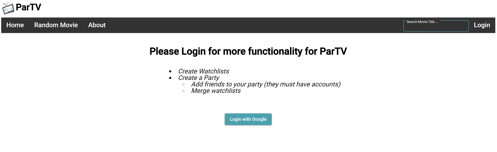

# ParTV
**Objective:**  The main purpose of ParTV is to create an easy way for friends and families to find a movie to watch.
## Specs
- Utilizes [The Movie Database API](https://developers.themoviedb.org/3/getting-started/introduction) & [Firestore](https://firebase.google.com/docs/firestore).
- Written in Angular
- Hosted on Heroku. http://partv.herokuapp.com/

## Table of Contents
- [Features](#features)
- [How to Run](#how-to-run-locally)
- [Testing](#testing)
- [Screenshots](#screenshots)
  * [Log in with Google](#log-in-with-google)
  * [Logged in](#logged-in)
  * [Homepage](#homepage)
  * [Movie Page](#movie-page)
  * [Randomize Movie](#randomize-movie)
  * [Search Movie](#search-movie)
  * [Create a Party](#create-a-party)

## Features
- Random Movie Generator
- Watchlists
- Create a Party (Merge User Watchlists)
- Movie Search & Movie Pages
- Displays 20 Top Rated, Now Playing, and Trending (Week) Movies
- Google Authentication 

## How to Run Locally: 
1. Must create a config.js with [tMDB APIKEY](https://developers.themoviedb.org/3/getting-started/introduction) if you want to run locally. ( under /src )
#### Example:
> export var config = {
    MY_KEY : '?api_key={insertkey}',
  }
2. Install dependencies: npm install  
3. Host server: ng serve --open (localhost:4200)

## Testing:
- Passed 54 tests (spec files) using Jasmine.
- Run Jasmine via ng test command.

## Screenshots

### Log in with Google
- Without logging in, you cannot add or delete movies from watchlists.
- No "Create a Party" functionality.

### Logged in
- You are able to see your current watchlists.
- You now can add or delete movies from watchlists.
- You can now "Create a Party".

### Homepage
- Each movie has an overlay that will show information about movie.
- Clicking on movie will send you to the movie page.
- Shows trending/now-playing/top-rated movies.
- **Example:** Trending Movies:

### Movie Page
- Each movie will show movie information and cast list.
- If logged in, you are able to ADD or DELETE from watchlist.
- Clicking on movie poster will send you to [IMDB](https://www.imdb.com/) page.
- **Example:** Movie: Little Women (Logged in & Movie in Watchlist)

### Randomize Movie
- You can pick a specific genre (or none) and ParTV will randomize a movie.
- Clicking Randomize will bring you to the Movie Page of the corresponding movie.

### Search Movie
- You can search movies by name and ParTV will send the movies that match your keywords.
- **Example:** Searching keyword "harry"

### Create a Party
- Only works if you are logged in.
- The other users you want to create a party with must have an account & watchlists with ParTV.
- Enter the emails of each user (up to 3) to create a party.
- You can see all watchlists of each user.
- Clicking "Merge" will show what movies each user shares.
- **Example:** Shows merging 2 emails with the current user (emails not depicted). Where 3 users all have those movies in their watchlist.

