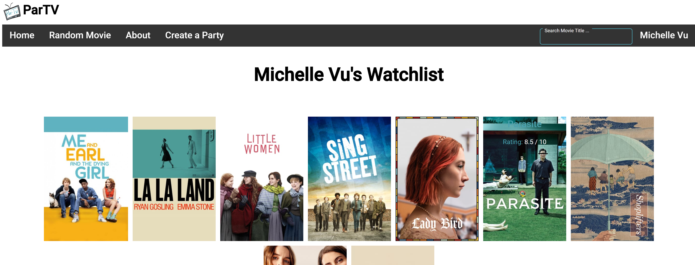
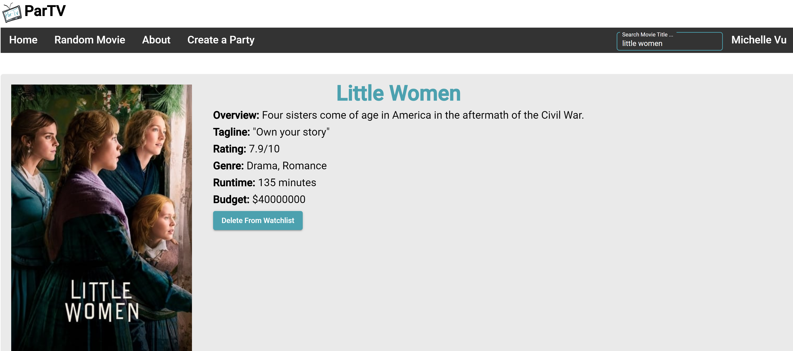
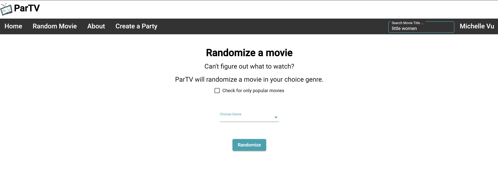

# ParTV
- Utilizes [The Movie Database API](https://developers.themoviedb.org/3/getting-started/introduction) & [Firestore](https://firebase.google.com/docs/firestore).
- Written in Angular

## Features
- Random Movie Generator
- Create a Party (Merge User Watchlists)
- Movie Search & Information Pages
- Displays 20 Top Rated, Now Playing, and Week's Most Popular Movies.
- Create an Account with Google
- Holds User Watchlists

## How to run locally: 
1. must create a config.js with [tMDB APIKEY](https://developers.themoviedb.org/3/getting-started/introduction) if you want to run locally.
##### example:
> export var config = {
    MY_KEY : '?api_key={insertkey}',
  }
2. Install dependencies: npm install  
3. Host server: ng serve --open (localhost:4200)

## Screenshots

### Log in with Google
- Without logging in, you cannot add or delete movies from watchlists.
- No "Create a Party" functionality.

### Logged in
- You are able to see your current watchlists.
- You now can add or delete movies from watchlists.
- You can now "Create a Party".

### Homepage shows trending/nowplaying/toprated movies
- Each movie has an overlay that will show information about movie.
- Clicking on movie will send you to the movie page.
- Example of trending movies:

### Movie Page
- Each movie will show movie information, and cast list.
- If logged in, you are able to ADD or DELETE from watchlist.
- Clicking on movie poster will send you to [IMDB](https://www.imdb.com/) page.
- Example of Movie: Little Women (Currently Logged in & Movie in Watchlist)

### Randomize Movie
- You can pick a specific genre (or none) and ParTV will randomize a movie.
- Clicking Randomize will bring you to the Movie Page of the corresponding movie.

### Create A Party
- Only works if you are logged in.
- The other users you want to create a party with must have an account & watchlists with ParTV
- Enter the emails of each user (up to 3) to create a party.
- You can see all watchlists of each user
- Clicking "Merge" will show what movies each user shares.
- Example: Shows merging 2 emails with the current user (emails not depicted). Where 3 users all have those movies in their watchlist.

